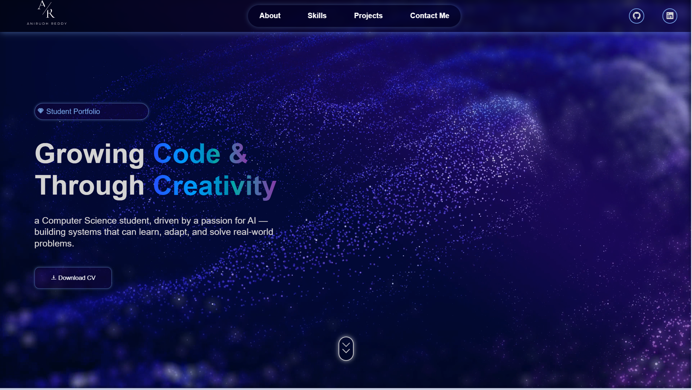
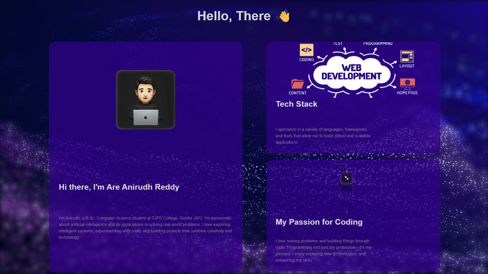
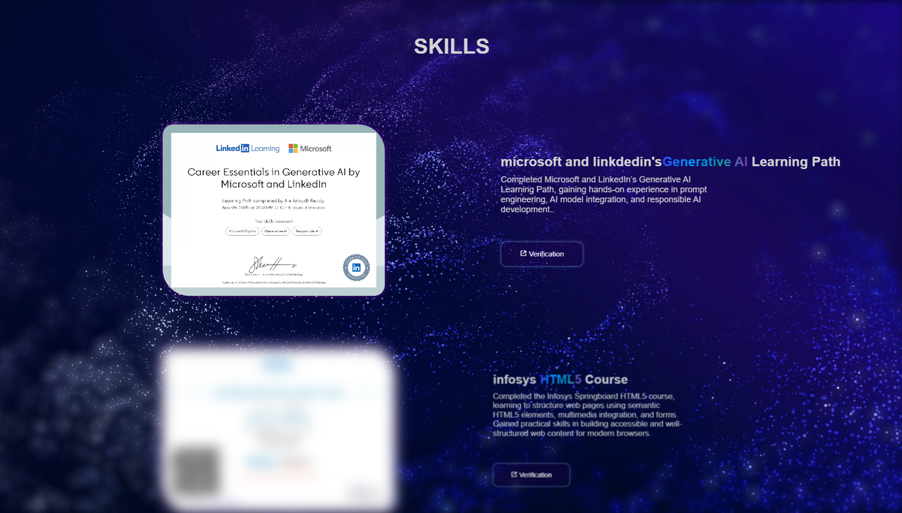
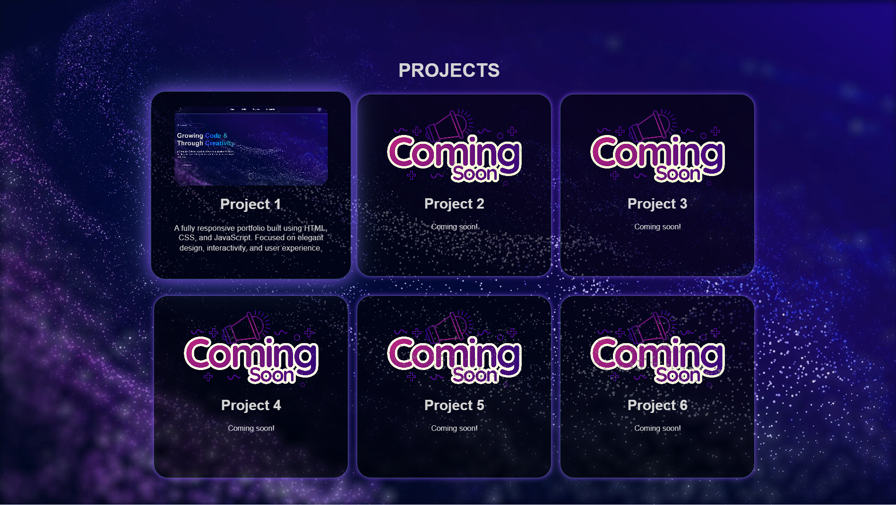
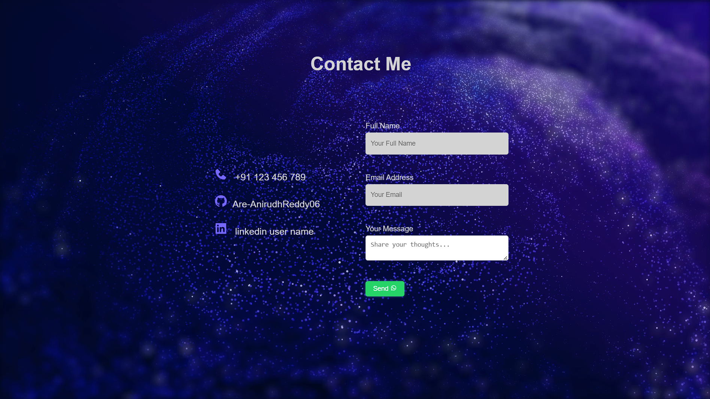

# my First Project - A Portfolio site

Welcome to my very first portfolio project! This project showcases my skills in  HTML, CSS, JavaScript and demonstrates my ability to build a responsive website.

## 📸 Screenshots

Here are some visuals of the project in action:

 

 

## 🚀 Features

- ✅ Responsive design (works on desktop, tablet, and mobile)  
- ✅ Interactive UI elements (buttons, hover effects, animations)  
- ✅ Hero / Introduction section with name, profession, and bio  
- ✅ About Me section with detailed information   
- ✅ Skills section showcasing technical skills with certificates  
- ✅ Projects section with descriptions,images and videos of projects  
- ✅ Contact form with name, email, message, and social links  
- ✅ Smooth scrolling navigation and sticky menu  
  

## 🛠️ Built With

- [Language/Framework 1: HTML5]
- [Language/Framework 2:  CSS3]
- [Language/Framework 3:  JavaScript]
- [library used : boxincons]

## 📂 Project Structure

project-portfolio
  |--images
  |__1000002543.jpg
  |__1000002550.png
  |__1000002631.jpg
  |__1000002688.png
  |__about-section.png
  |__anirudhlogo.png
  |__comingsoon!.jpg
  |__contact-section.png
  |__grid4.png
  |__hero-section.png
  |__projects-section.png
  |__skills-section.png
  |__teckstack.png
  |__about.png
  |--videos
  |__7952139-uhd_3840_2160_30fps.mp4
  |--app.js
  |--index.html
  |--style.css
  |--readme.md

  
## 📦 Installation

To run this project locally:

--bash 
git clone https://github.com/Are-AnirudhReddy06/portfolio-project.git
cd portfolio-project
open index.html

## 👋 About Me

Hi! I'm Anirudh Reddy, a BSc Computer Science student passionate about "coding, problem-solving, and building projects".  

I enjoy exploring web development, algorithms, and modern technologies. My goal is to turn ideas into real-world applications and continuously improve my programming skills.  

On my GitHub, you'll find projects that showcase my skills in HTML, CSS, JavaScript, and other technologies I’m learning along the way.  

I’m open to "collaboration, learning new things, and contributing to open-source projects". Let's create something amazing together!

📫 Contact
- GitHub: [https://github.com/Are-AnirudhReddy06]
- LinkedIn: [https://www.linkedin.com/in/are-anirudh-reddy-183a37395]
- Email: [are.anirudhreddy@gmail.com]

